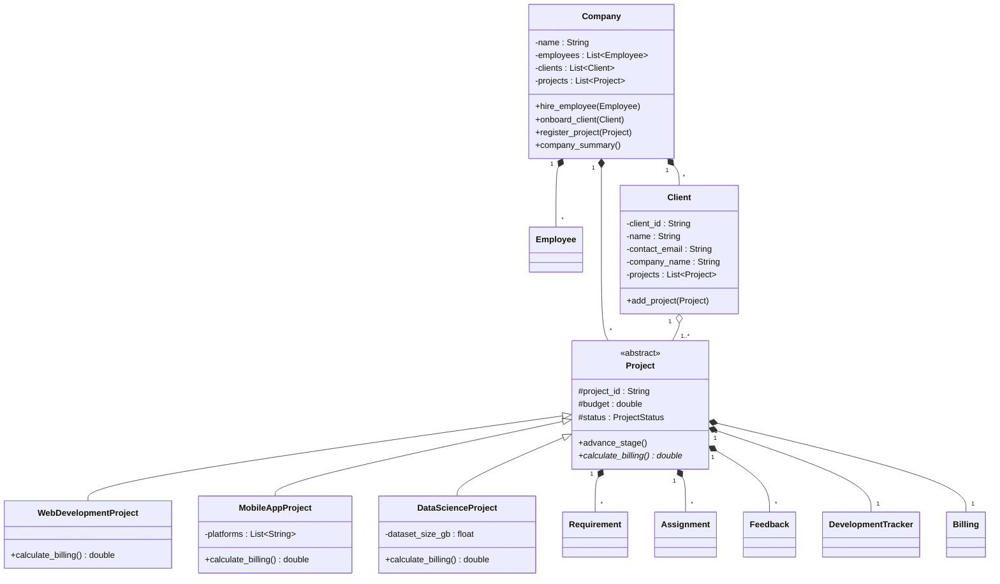

# Project Management System
**Submitted By:** Muyazzem Hossain  
**Roll No:** 002511002012  

## 1. Brief Introduction
The Project Management System (PMS) is a comprehensive software application designed to handle the intricate relationships between a development company, its clients, employees, and diverse technological projects. It leverages standard Object-Oriented Programming principles to logically encapsulate project data, employee tracking, and dynamic billing integrations. 

## 2. Objective
The core objective of this assignment is to meticulously implement a strictly compliant Java architecture mapped exactly from a predefined UML Class Diagram. This involves:
- Implementing tight entity relationships (Composition and Aggregation).
- Building Polymorphic inheritance models for diverse project subclasses (`WebDevelopmentProject`, `MobileAppProject`, `DataScienceProject`).
- Generating an interactive Graphical User Interface (GUI) and/or dynamic Web Dashboard to showcase project states visually.
- Enforcing validation bounds and comprehensive error-free test cases validating business logic.

## 3. UML Design Specification
The architecture relies on the `Project` superclass as an abstract blueprint, enforcing a localized State pattern via `DevelopmentTracker` and distinct enumerations for Status. 



*Design Details:*
1. **Inheritance (IS-A):** `WebDevelopmentProject`, `MobileAppProject`, and `DataScienceProject` inherit from `Project`, overriding the virtual `calculate_billing()` logic to apply multiplier taxes based on platform or datasets.
2. **Aggregation (HAS-A):** The `Company` maintains aggregates of disconnected `Clients` and `Employees`.
3. **Composition:** Each `Project` strongly manages its own internalized `DevelopmentTracker` and `Billing` classes, meaning these objects die if the Project is deleted.

## 4. Test Case Validations (Output)
The system logic was heavily validated against a programmatic Unit Test suite (`TestCases.java`).

**Console Execution Output:**
```text
=== Starting Unit Tests Validation ===
[PASS] WebDevelopmentProject billing calculated correctly.
[PASS] MobileAppProject billing calculated correctly.
[PASS] DataScienceProject billing calculated correctly.
[PASS] DevelopmentTracker successfully steps from PLANNING to DEVELOPMENT.
[PASS] Billing accurately transitions between PARTIAL and PAID state.

=== Test Results: 5/5 Passed ===
```
## 5. GitHub Repository Link
**https://github.com/Raju8184/project-management-system.git**
